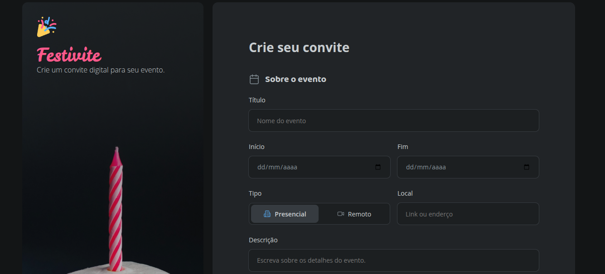
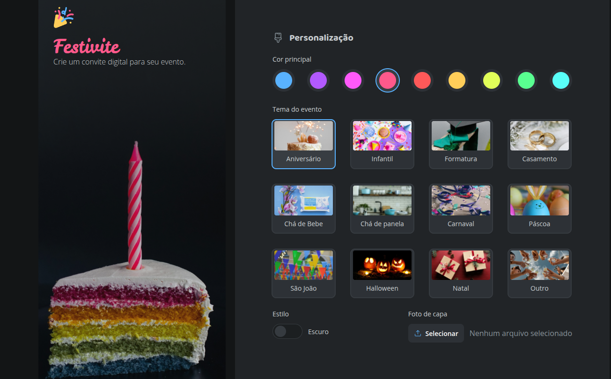
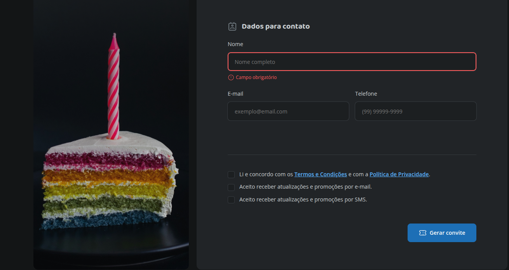

# 📝 Formulário de Convite

Projeto da **Parte 1** do curso **Full-Stack**, utilizando apenas **HTML e CSS**.  
O objetivo é praticar a criação e estilização de **formulários em HTML**, através de um formulário de convite para evento.

---

## 🖼️ Preview

   
   
  

---

## 🚀 Tecnologias

- HTML5 (Formulários)  
- CSS3

---

## ▶️ Como visualizar

1. Clone este repositório  
2. Acesse a pasta `formulario-de-convite`  
3. Abra o arquivo `index.html` no navegador
