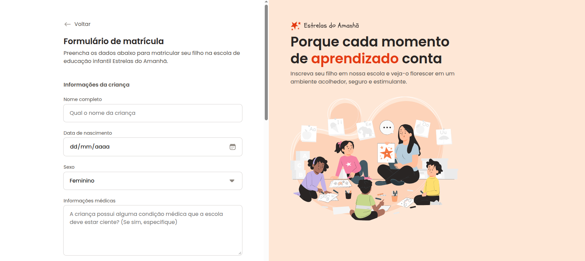
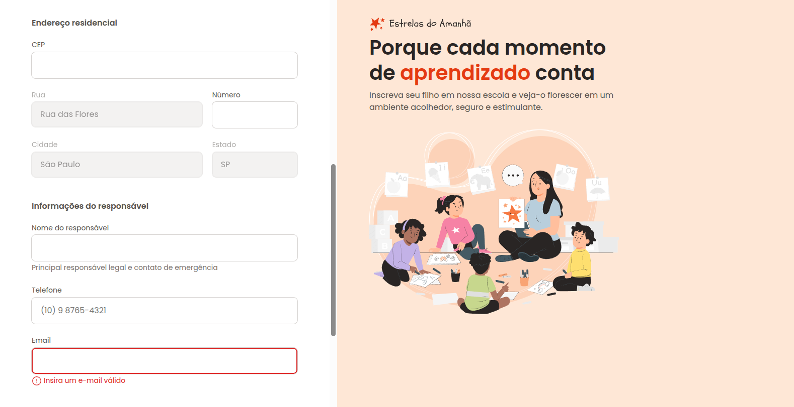

# 🎓 Formulário de Matrícula

Projeto da **Parte 1** do curso **Full-Stack**, utilizando apenas **HTML e CSS**.  
O objetivo é praticar a criação de **formulários complexos**, simulando uma ficha de matrícula para escola.

---

## 🖼️ Preview

   
  

---

## 🚀 Tecnologias

- HTML5 (Formulários)  
- CSS3

---

## ▶️ Como visualizar

1. Clone este repositório  
2. Acesse a pasta `formulario-de-matricula`  
3. Abra o arquivo `index.html` no navegador
