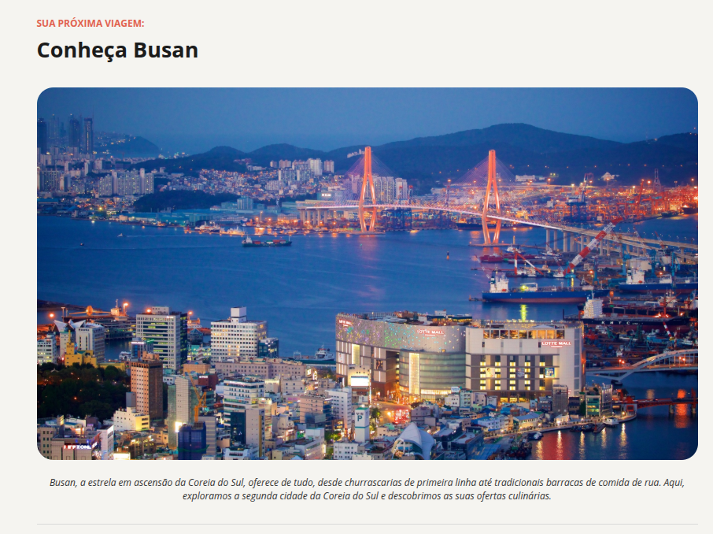
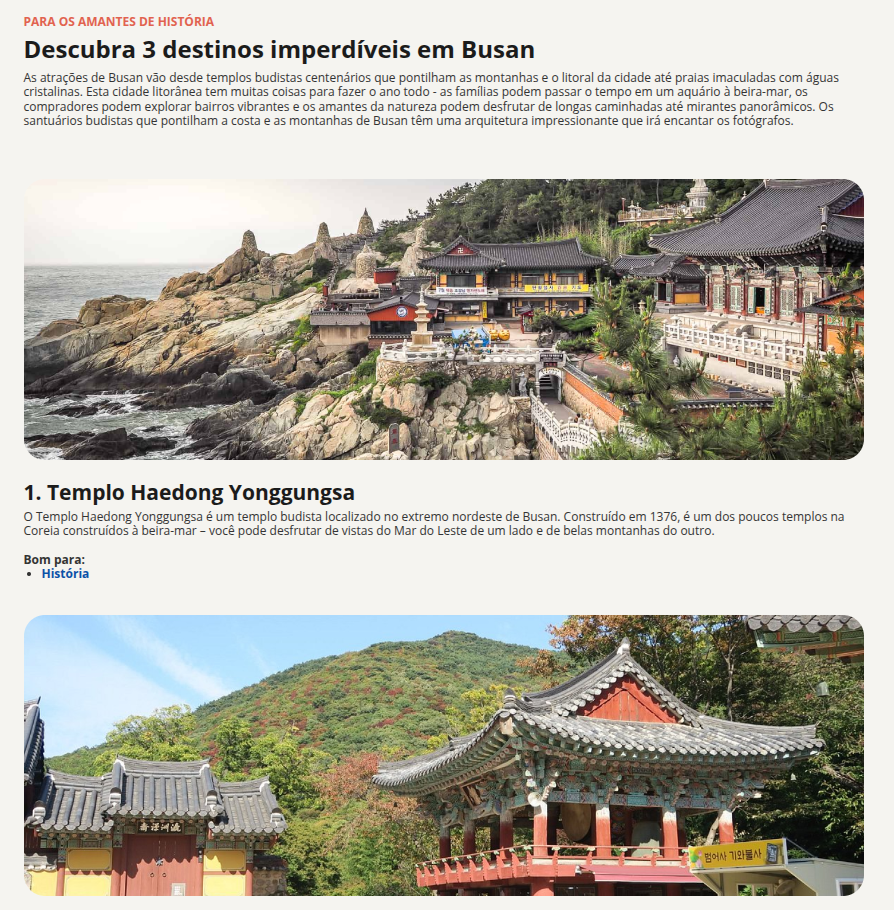
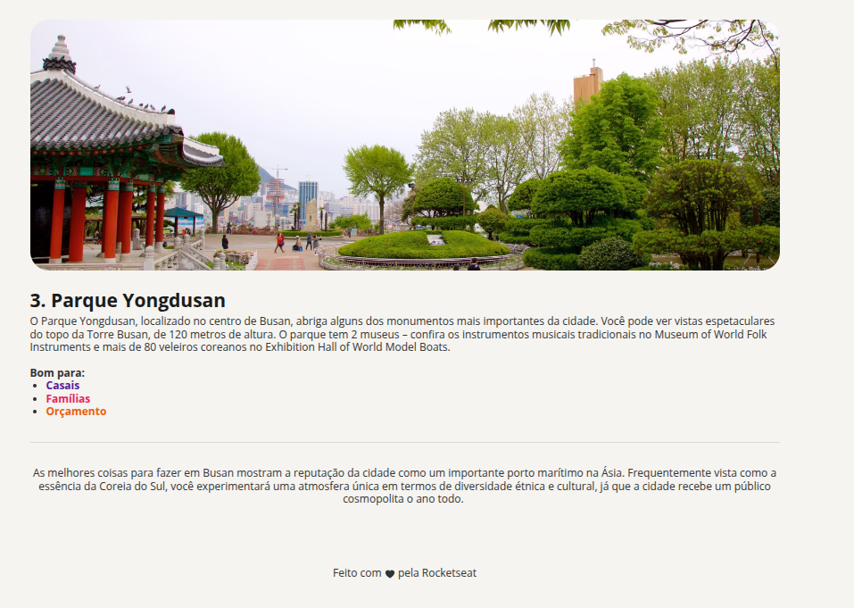

# 🏞️ Local Turístico

Projeto da **Parte 1** do curso **Full-Stack**, utilizando apenas **HTML e CSS**.  
O objetivo é praticar estruturação de conteúdo e aplicação de estilos em uma página sobre um local turístico (**BUSAN**).

---

## 🖼️ Preview

   
   
  

---

## 🚀 Tecnologias

- HTML5  
- CSS3

---

## ▶️ Como visualizar

1. Clone este repositório  
2. Acesse a pasta `local-turistico`  
3. Abra o arquivo `index.html` no navegador
