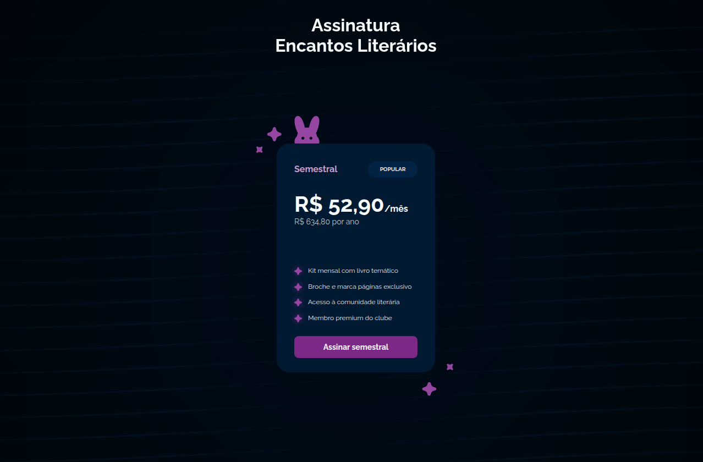

# 📩 LP de Assinatura (Encantos Literários)

Projeto da **Parte 1** do curso **Full-Stack**, utilizando apenas **HTML e CSS**.  
O objetivo é criar uma **Landing Page de assinatura**, aplicando **responsividade + animações em CSS**.

---

## 🖼️ Preview

   
   
  

---

## 🚀 Tecnologias

- HTML5  
- CSS3 (Responsividade + Animações)

---

## ▶️ Como visualizar

1. Clone este repositório  
2. Acesse a pasta `lp-de-assinatura`  
3. Abra o arquivo `index.html` no navegador
