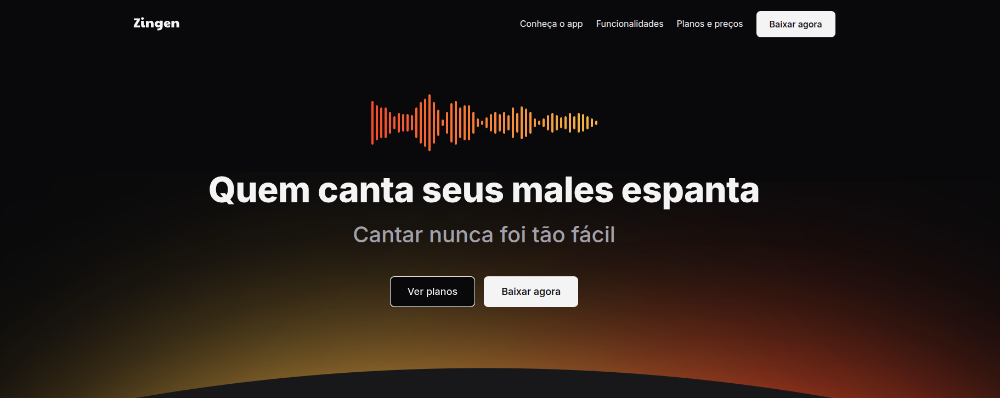
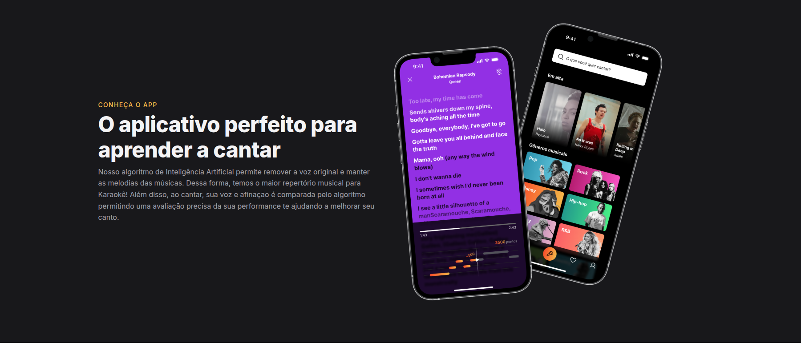
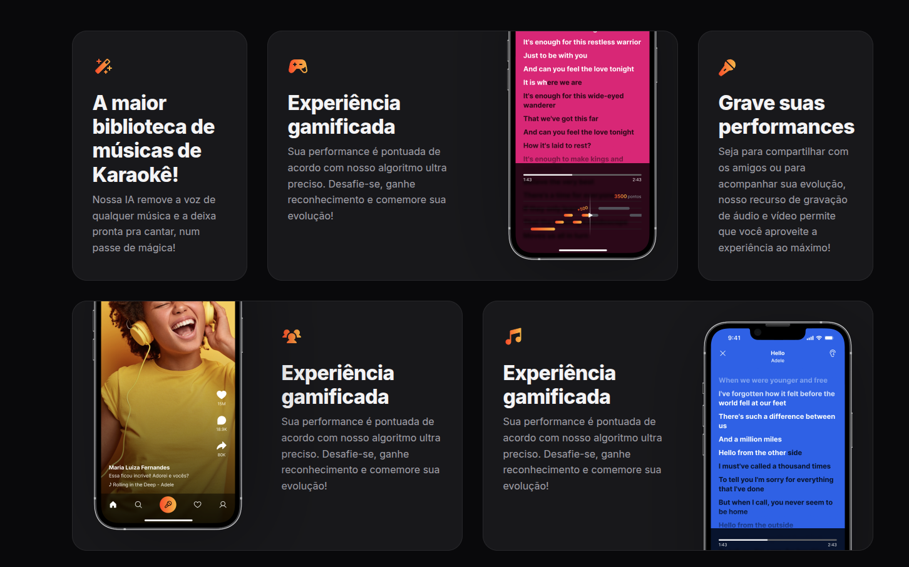
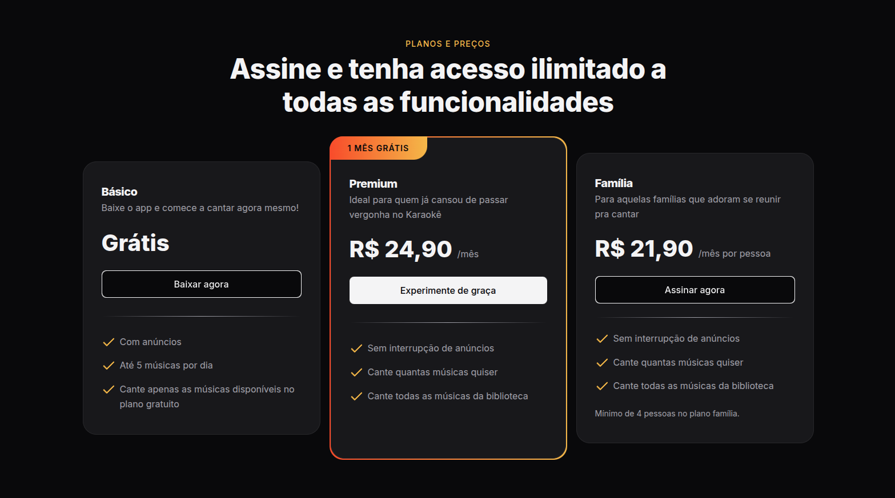

# 🛒 LP de Produto - Zingen

Projeto da **Parte 1** do curso **Full-Stack**, utilizando apenas **HTML e CSS**.  
O objetivo é criar uma **Landing Page de produto** e aplicar **responsividade** para diferentes tamanhos de tela.

---

## 🖼️ Preview

   
   
   
   

---

## 🚀 Tecnologias

- HTML5  
- CSS3 (Responsividade com Media Queries)

---

## ▶️ Como visualizar

1. Clone este repositório  
2. Acesse a pasta `lp-de-produto`  
3. Abra o arquivo `index.html` no navegador