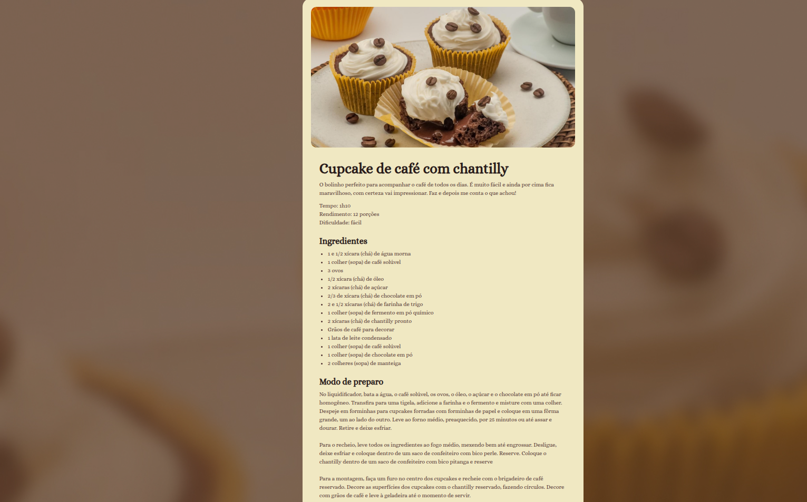

# 🍲 Página de Receita - Parte 1

Projeto da **Parte 1** do curso **Full-Stack**, utilizando apenas **HTML e CSS**.  
O objetivo é praticar marcação semântica e estilização de uma página simples de receita.

---

## 🖼️ Preview

  

---

## 🚀 Tecnologias
- HTML5
- CSS3

---

## ▶️ Como visualizar
1. Clone este repositório
2. Acesse a pasta `pagina-receita`
3. Abra o arquivo `index.html` no navegador