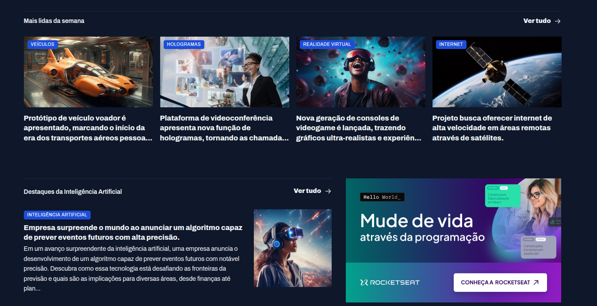
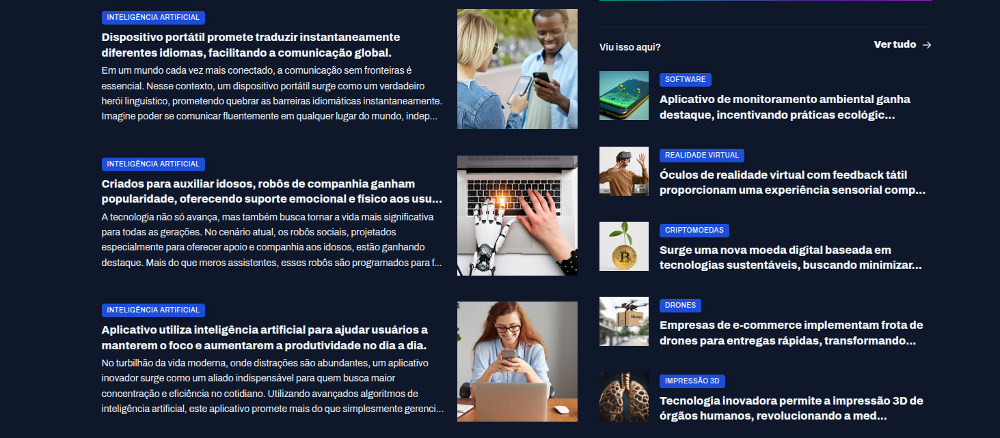

# 📰 Portal de Notícias

Projeto da **Parte 1** do curso **Full-Stack**, utilizando apenas **HTML e CSS**.  
O objetivo é praticar o uso de **Grid Layout** na criação de um portal de notícias.

---

## 🖼️ Preview

   
   
  

---

## 🚀 Tecnologias

- HTML5  
- CSS3 (Grid Layout)

---

## ▶️ Como visualizar

1. Clone este repositório  
2. Acesse a pasta `portal-de-noticias`  
3. Abra o arquivo `index.html` no navegador
