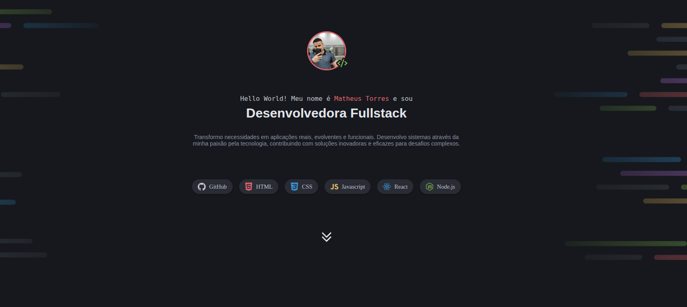
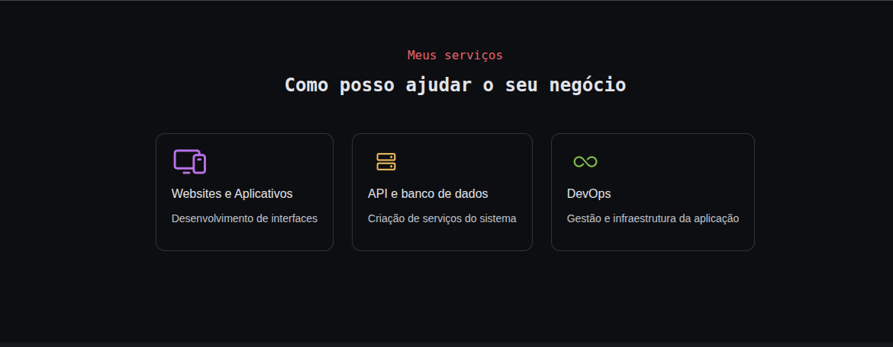
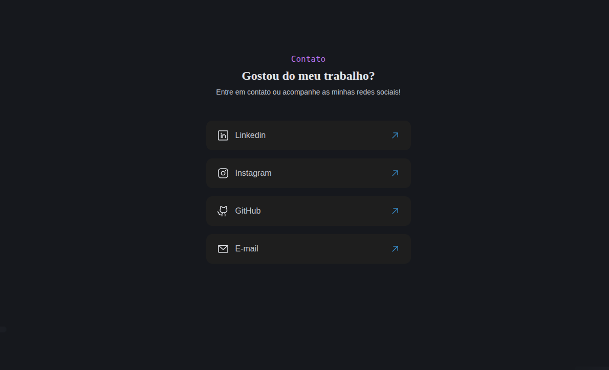

# 💻 Portfolio Dev

Projeto da **Parte 1** do curso **Full-Stack**, utilizando apenas **HTML e CSS**.  
O objetivo é praticar a combinação de **Flexbox + Grid Layout** na construção de um portfólio para desenvolvedor.

---

## 🖼️ Preview

   
   
  

---

## 🚀 Tecnologias

- HTML5  
- CSS3 (Flexbox + Grid)

---

## ▶️ Como visualizar

1. Clone este repositório  
2. Acesse a pasta `portfolio-dev`  
3. Abra o arquivo `index.html` no navegador
