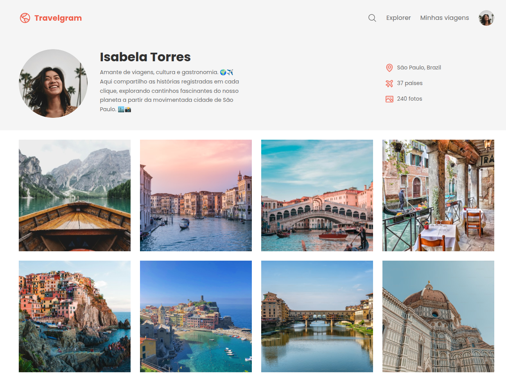
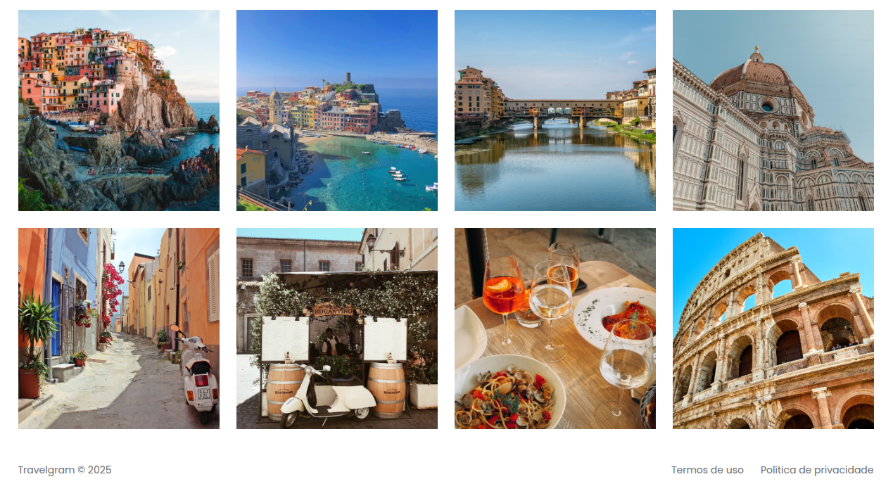

# 🌍 Travelgram - Parte 1 

Projeto da **Parte 1** do curso **Full-Stack**, utilizando apenas **HTML e CSS**.  
O objetivo é praticar o uso de **Flexbox** na construção de uma página estilo rede social de viagens.

---

## 🖼️ Preview

   
   

---

## 🚀 Tecnologias

- HTML5  
- CSS3 (Flexbox)

---

## ▶️ Como visualizar

1. Clone este repositório  
2. Acesse a pasta `travelgram`  
3. Abra o arquivo `index.html` no navegador
